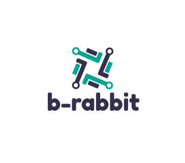

========
b-rabbit
========

.. image:: https://img.shields.io/pypi/v/b-rabbit.svg
        :target: https://pypi.python.org/pypi/b-rabbit

.. image:: https://img.shields.io/travis/nidhaloff/b_rabbit.svg
        :target: https://travis-ci.com/nidhaloff/b-rabbit

.. image:: https://readthedocs.org/projects/b-rabbit/badge/?version=latest
        :target: https://b-rabbit.readthedocs.io/en/latest/?badge=latest

.. image:: https://img.shields.io/pypi/pyversions/b-rabbit
        :alt: PyPI - Python Version
        :target: https://b-rabbit.readthedocs.io/en/latest/?badge=latest

.. image:: https://img.shields.io/pypi/wheel/b-rabbit
        :alt: PyPI - Wheel
        :target: https://pypi.python.org/pypi/b-rabbit

.. image:: https://pepy.tech/badge/b-rabbit
    :target: https://pepy.tech/project/b-rabbit

.. image:: https://img.shields.io/twitter/url?url=https%3A%2F%2Ftwitter.com%2FNidhalBaccouri
        :alt: Twitter URL
        :target: https://twitter.com/NidhalBaccouri

RabbitMQ without headache.
---------------------------

b-rabbit is a RabbitMq client library that aims to make interfacing with RabbitMQ easier. It is very useful especially
inside large projects, in which many boilerplate code must be written.

I started this project when I was working on a large microservices-based project in a large team.
I decided to open-source the project afterwards.

* Free software: MIT license
* Documentation: https://b-rabbit.readthedocs.io.

Features
--------

- it implements all RabbitMQ messaging patterns.
- provides an easy high level API (take a look at the examples)
- thread safe

When you should use it
----------------------
- if you are having problems with other non thread safe libraries (like I did)
- if you want to develop fast by using a high level API
- if you don't want to write much code and save much time
- if you want to use multithreading

Quick Usage
------------

import the library:

.. code-block:: python

    from b_rabbit import BRabbit

create a parent instance which provide a global rabbitMQ connection

.. code-block:: python

    rabbit = BRabbit(host='localhost', port=5672)

now, just one liner to publish a message:

.. code-block:: python

    publisher = rabbit.EventPublisher(b_rabbit=rabbit,
                                      publisher_name='pub').publish(routing_key='testing.test',
                                                                    payload='Hello from publisher')

or if you want to subscribe and listen to a certain topic:

.. code-block:: python

     def callback(msg):
        # do something with the received msg from the publisher
        print(f"msg received: {msg}")

    # subscribe and run a listener in a thread

    subscriber = rabbit.EventSubscriber(
                                    b_rabbit=rabbit,
                                    routing_key='testing.test',
                                    publisher_name='pub',
                                    event_listener=callback).subscribe_on_thread()

Advanced Usage using RPC
--------------------------

- task requester

.. code-block:: python

    from b_rabbit import BRabbit

    def taskResponseListener(body):
        print('Task Response received')
        print(str(body))

    rabbit = BRabbit(host='localhost', port=5672)
    taskRequesterSynchron = rabbit.TaskRequesterSynchron(b_rabbit=rabbit,
                                                         executor_name='test',
                                                         routing_key='testing.test',
                                                         response_listener=taskResponseListener)

    taskRequesterSynchron.request_task('msg from requester')
    rabbit.close_connection()

- task responser (server)

.. code-block:: python

    from b_rabbit import BRabbit
    import time

    rabbit = BRabbit(host='localhost', port=5672)

    def taskListener(server, body):
        print('Task Request received')
        print(str(body))
        time.sleep(5)
        server.send_return(payload="return this value to requester")

    taskExecuter = rabbit.TaskExecutor(b_rabbit=rabbit,
                                       executor_name='test',
                                       routing_key='testing.test',
                                       task_listener=taskListener).run_task_on_thread()

Further
--------

Take a look in the examples folder for more. b_rabbit implements also the remote procedure call (RPC) pattern

